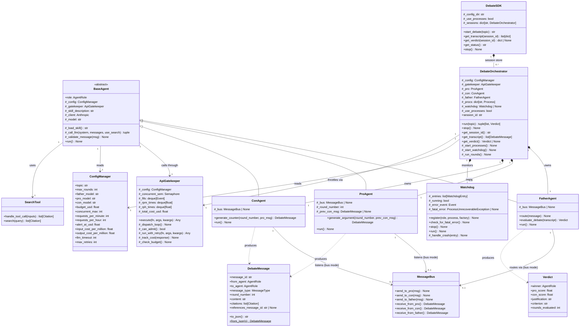

# Architecture — Class Diagram

This diagram satisfies the §8.6 requirement: "must add an architecture diagram showing class
structure and relationships."

## Class Hierarchy & Relationships



## ASCII Summary (agent message flow)

```
CLI / Terminal
     │
     ▼
 DebateSDK          ← only public interface
     │
     ▼
DebateOrchestrator
     │
     ├──[spawn]──► PRO  Process  ──JSON──►┐
     │                                    │
     ├──[spawn]──► CON  Process  ──JSON──►├──► FATHER Process ──► Verdict
     │                                    │
     └──[spawn]──► FATHER Process◄────────┘

All LLM calls pass through ApiGatekeeper (FIFO + rate-limit + budget).
Watchdog daemon thread monitors all three processes.
```
